# product-management
CRUD operation in one project for product management system .

**Demo**
 
<a href="https://tal-81.github.io/product-management/" target="_blank">Click here to visit <strong> Product Management <strong> Website</a>

## 📑 Table of Contents
- [Project Overview](#project-overview)
- [Responsive Design](#responsive-design)
- [Script Languages Used](#script-languages-used)
- [Technologies Used](#technologies-used)
- [Screenshots](#screenshots)
- [Design Wireframes](#design-wireframe)
- [User Experience](#user-experience)     
- [Testing](#testing)
- [Deployment](#deployment)

  

## Project Overview

🌟 Local Product Management System Features
This system offers an integrated and efficient interface for product management, prioritizing local performance and independence.

💾 Core Feature: Local Data Persistence in local browser
The system is uniquely capable of saving all product data locally without requiring a connection to a remote server or external database. This ensures faster access and complete operational autonomy.

🧮 Financial Calculation and Pricing
Automated Price Calculation: The system efficiently handles essential financial calculations. It automatically calculates the product tax and discount based on the base price, and accurately displays the final total price.

📝 Data Management and Navigation
Comprehensive Data Control (CRUD): The system provides full functionality for the four fundamental data management operations:

Add: Inserting new products into the inventory.

Read: Displaying and retrieving product details.

Update: Modifying details of existing products.

Delete: Removing one or more products from the system.

Simple Pagination: The product table is displayed using a simple pagination mechanism, showing only 5 products per page for streamlined viewing and easier data handling.

## Responsive Design
*  It features a responsive design optimized for various devices.
* The interface ensures a seamless experience across all screen sizes and devices.
* The application provides a consistent experience across desktop, tablet, and mobile devices.

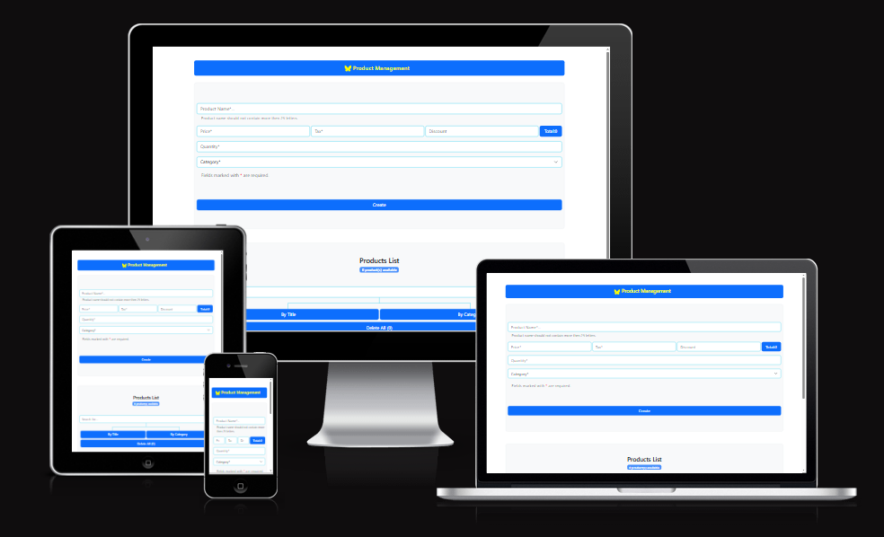

## Script Languages Used

* 
* 
* 

## Technologies Used

* 
* 
* 
* 
* 

## Screenshots

* Product Management has one page.
### Desktop:
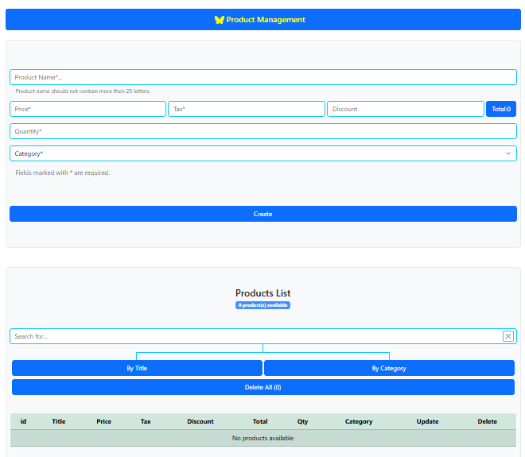

### Mobile:
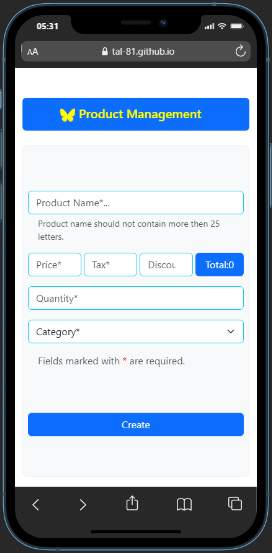
  
## Design Wireframe
### Desktop Design:
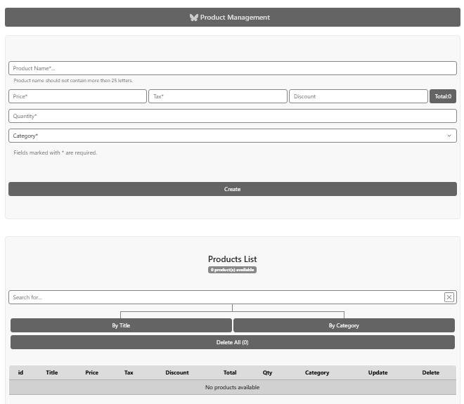
 

### Mobile Design:
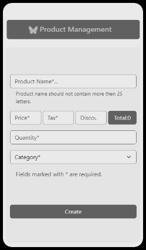
 

## User Experience
### Goals

Primary Goals of the Product Management System
The primary goal of designing this Product Management System is to deliver an effective, user-friendly, and locally-optimized platform dedicated to efficient product control and inventory monitoring.

💼 ***Functional and Operational Objectives***
* Comprehensive Data Control (CRUD): To empower users with the capability to perform all essential data management operations: Adding, Reading, Updating, and Deleting products, individually or in batches.

* Operational Autonomy: To ensure the system’s ability to save and process data locally (via Local Storage), guaranteeing speed and reliability without dependency on external servers or constant internet connectivity.

* Accurate Financial Calculations: To provide integrated calculation tools that accurately and instantly determine taxes and discounts, and clearly display the final total price.

* Responsive Design: To build a fully responsive user interface that adapts seamlessly and provides an optimal user experience across all devices, including desktops, tablets, and smartphones.

🚀 ***User Experience and Performance Goals***
* Simplified Navigation: To manage large datasets effectively by employing pagination, displaying a limited number of products per page to streamline viewing and data review.

* Clarity and Efficiency: To offer an intuitive and clean user interface that allows users to complete tasks quickly with minimal steps, enhancing overall workflow efficiency.

### Target Group
* Small Business Owners / Solo Entrepreneurs: Individuals who need a simple, cost-effective tool to track a limited inventory or service list without subscribing to complex cloud-based SaaS solutions.

* Retail Managers (Local Scale): Personnel responsible for managing stock levels, setting prices, and applying discounts for a small, single-location business (e.g., boutique stores, small cafes, local workshops).

* Data Entry Specialists / Admins: Users whose primary responsibility is performing routine CRUD (Create, Read, Update, Delete) operations to maintain accurate product records quickly and efficiently.

* Budget-Conscious Users: Individuals seeking a powerful, responsive tool that provides financial calculations (tax/discount) and data structuring without requiring a dedicated IT infrastructure or remote hosting.

* Developers / Students (for educational use): Users interested in a clean, functional application to inspect and learn about front-end CRUD logic and local data persistence via the browser. 

---

### User Goals
The primary goals for users interacting with the Product Management System are focused on efficient data handling and smooth functionality:

* Efficient Data Management (CRUD): Quickly and easily Add, Read, Update, and Delete product records to keep the inventory current and accurate.

* Rapid Financial Calculation: Input product details and instantly view the calculated tax, discount, and final total price without the need for external tools.

* Seamless Local Operation: Manage and save product data directly within the browser (Local Storage), ensuring reliability and speed even without an active internet connection.

* Simplified Navigation: Effortlessly browse through the product list using pagination to manage and locate items in large datasets.

* Intuitive and Responsive Experience: Utilize a clean, modern interface that provides a consistent and smooth experience across desktop, tablet, and mobile devices.

### Business Goals
The business goals for developing and maintaining this Local Product Management System are centred on providing maximum utility and efficiency for small-scale operations:

* Enhance Data Efficiency: Provide a fast, reliable tool that significantly reduces the time and effort required for routine product data entry and maintenance (CRUD operations).

* Increase Operational Autonomy: Offer a solution that ensures business continuity by operating entirely on local storage, minimizing reliance on external servers and potential hosting costs.

* Promote Accuracy in Pricing: Ensure precise financial calculations (tax and discount) are consistently applied, reducing pricing errors and increasing confidence in total cost figures.

* Maximize User Adoption: Deliver a highly intuitive and responsive user experience (UX) to ensure quick adoption by staff and minimal training requirements.

* Establish Reliability and Trust: Build a reputation for delivering a stable, functional, and consistent application across all supported devices, reinforcing its credibility as a dependable management tool.

### How *Product Management* Achieves These Goals

| **Feature** | **Description** | **Reinforces Goal** |
|--------------|----------------|----------------------|
| **Local Storage Integration** | Utilizes browser's local storage for data persistence, ensuring all product records are saved and retrieved instantly. | Seamless Local Operation / Increase Operational Autonomy |
| **CRUD Functionality** | Clear, intuitive buttons/inputs allow users to Add, Update, Read, and Delete product entries effortlessly. | Efficient Data Management / Enhance Data Efficiency |
| **Auto-Calculation Fields** | Dedicated input fields calculate Tax, Discount, and Total Price in real-time as the user types. | Rapid Financial Calculation / Promote Accuracy in Pricing |
| **Responsive Layout** | The design ensures the product table and input forms are fully usable and display correctly on mobile, tablet, and desktop screens. | Intuitive and Responsive Experience / Maximize User Adoption |
| **Simple Pagination (5 Items)** | Limits product display to 5 items per page, with navigation controls to manage browsing through extensive data lists. | Simplified Navigation / Enhance Data Efficiency |
| **Clean, Structured Interface** | Minimalist design focusing on data clarity, ensuring inputs and data tables are easy to read and interact with. | Intuitive and Responsive Experience / Establish Reliability and Trust |
| **Confirmation/Alert Messages** | Provides clear feedback (e.g., "Product Added Successfully" or "Error saving data") after every major CRUD action. | Efficient Data Management / Establish Reliability and Trust |

### User Stories
💾 Data Management (CRUD)
As a Small Business Owner, I want to add new products quickly and easily so I can keep my inventory updated.

As a Data Entry Specialist, I want to be able to view, edit, and delete existing product entries so I can maintain accurate records.

As a Retail Manager, I want to be able to save product records locally so I can manage my inventory even without an internet connection.

As a User, I want the system to provide clear confirmation messages after I add, update, or delete a product so I know my actions were successful.

🧮 Calculation and Pricing
As a Manager, I want the system to automatically calculate the tax and discount on a product price so I can instantly see the final selling price.

As a User, I want the total price displayed immediately after entering the base price and tax/discount so I can verify the financial details quickly.

💻 Usability and Interface
As a Mobile User, I want the data table and input forms to adjust correctly on my phone screen so I can manage products on the go.

As a User with many products, I want to see the products divided into pages (paginated) so I can browse the list without excessive scrolling.

As a Returning User, I want the interface to be intuitive and clutter-free so I can find the Add/Update/Delete buttons quickly and efficiently.

        
## Testing
* By(W3C CSS Validator Jigsaw/ W3C HTML Validator)

* The website has been tested and includes a responsive design, a readable navbar, and working form with enhanced UI and UX.

### <u>Project Highlights and Achievements</u>
* Responsive Design and Accessibility: The website has been rigorously tested and features a fully responsive design, ensuring a seamless and optimal experience across all major devices (desktop, tablet, and mobile).

* Enhanced Navigation: Includes a readable and intuitive Navbar, which ensures users can navigate smoothly and efficiently between sections.

*Optimized User Interaction (UI/UX): Features a fully operational form developed with an enhanced User Interface (UI) and User Experience (UX), focusing on clarity, ease of use, and effective feedback mechanisms.

### Test HTML file:
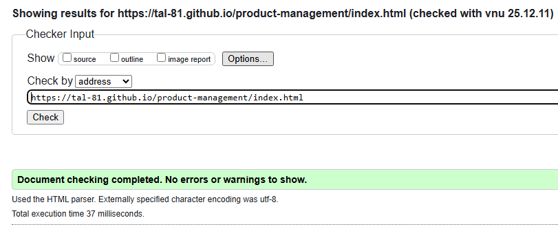

### Test CSS file:
1.  _style.css_:
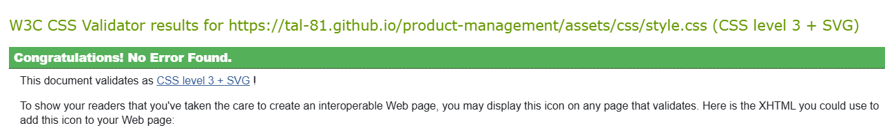

### Test Javascript file:
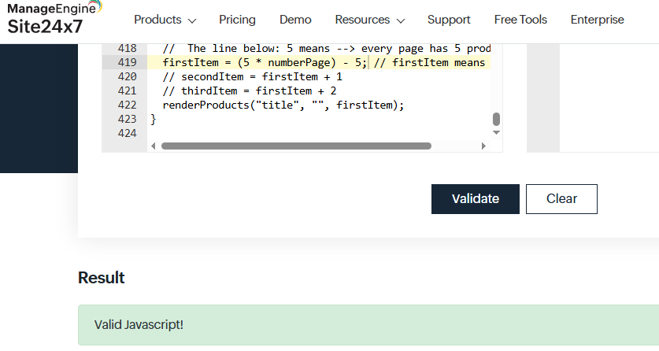

### Test Website by Lighthouse Tool from Google Chrome:
*  _Performance, SEO, Accessibility and Prctice_: 
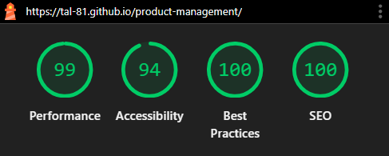

### Bugs & Fixes
1.    aria-discribedby html attribute found in input html element write by bootstrap but I did not let this attribute pointo other html element by id attribute :
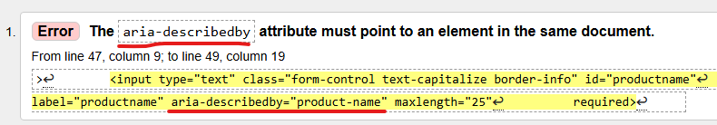
        * add id in other html element and this id must has name like aria-describedby.
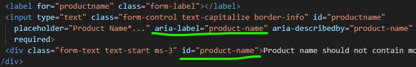
2.    function (pagination) cannot call (btnPage) number pages in pagination bar the reason is the buttons create after DOM created, the buttons number pages create dynamically by javascript for that they create after Dom:

        * Move definition of btnPage from global scope to inside function pagination that needs that variable.
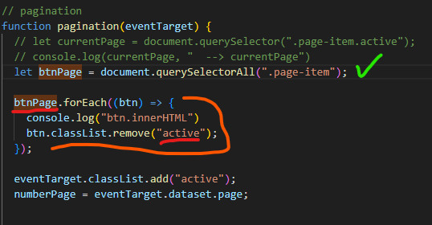
3.    The issue is semicoln missing on line 419 that message displaying by Javascript validator and it fixed by adding semicoln to the end of this line:
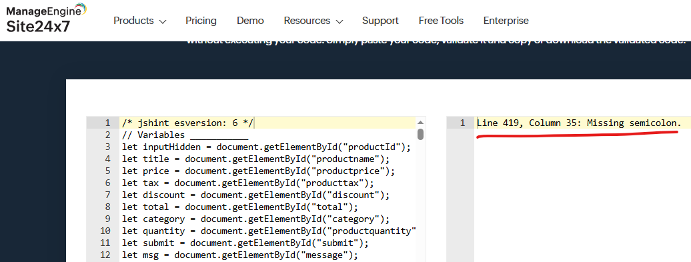
4.    Pagination buttons is runing not I expected when I click on button number 3 must it bring items that placed in indexs(6,7,8) in the products array but It bring items in indexs(0,1,2) that was issue  :
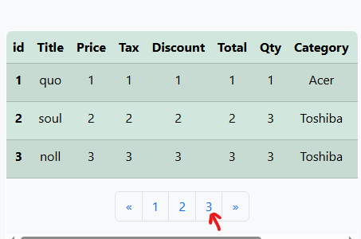
        * I followed this process by inspector tool that found in google chrome and I fixed this issue by rewriting the mathematical equation that appropriate this process.
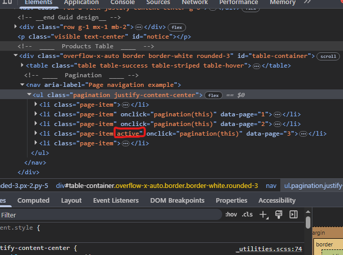
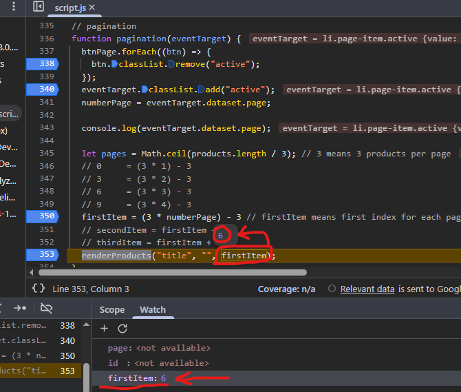
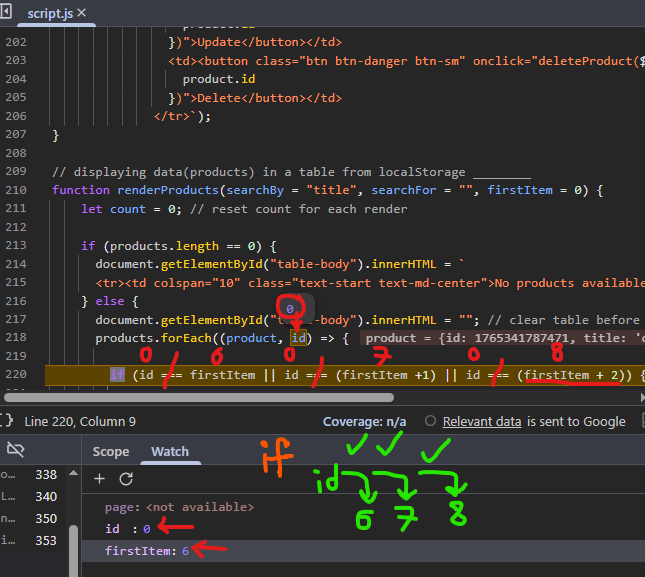

### Unfixed bugs
* None

## Deployment
### GitHub Pages

The project was deployed to GitHub Pages using the following steps.

1. Log in to GitHub and locate the [GitHub Repository](https://github.com/Tal-81/product-management)
2. At the top of the Repository (not top of page), locate the "Settings" Button on the menu.
3. In the menu on the left-hand side, under "Code and automation", select "Pages".
4. Under "Source", click the dropdown which says "None" and select "main", then click "Save".
5. Refresh the page if it does not do so automatically.
6. A link to the published site will appear at the top of the page.
 
* [Product Management](https://tal-81.github.io/product-management/)
  

## Acknowledgements

* The whole team at [Code Institute](https://codeinstitute.net/) for their teaching and support.
* To Chatgpt and Gemini when I need remember javascript instruction ask AI and get best answer.
* Idea from [JB WEBDEVELOPER](https://www.youtube.com/watch?v=LyfUTRJ2gOs) youtube channel.

[Back Top](#product-management)
